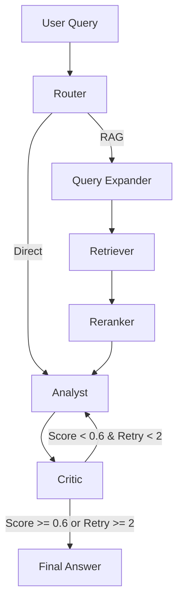

# Argus-AI Architecture

Argus-AI is a stateful multi-agent RAG (Retrieval-Augmented Generation) system built with LangGraph, FastAPI, and Qdrant.

## System Workflow

The system uses a directed acyclic graph (with loops for critique) to process user queries.

## Core Components

### 1. Router
Determines the processing path. If the query is a simple greeting, it bypasses the RAG pipeline for a direct response. Otherwise, it triggers the full retrieval flow.

### 2. Query Expander
To improve retrieval recall, the expander generates multiple variations or sub-queries. This helps in finding relevant documents that might not match the original query's exact phrasing.

### 3. Retriever (Qdrant)
Uses semantic search via Qdrant to fetch the most relevant document chunks. We migrated from FAISS to Qdrant to support production-grade features like metadata filtering and persistence.

### 4. Reranker
A cross-encoder style reranking step where the LLM evaluates the retrieved chunks and selects the top 3 most relevant ones. This reduces noise in the context provided to the Analyst.

### 5. Analyst
The core generation agent. It takes the retrieved context and the original query to produce a structured, grounded answer.

### 6. Critic
A "human-in-the-loop" style automated agent that evaluates the Analyst's output. It checks for:
- Faithfulness (Is the answer supported by context?)
- Hallucinations (Does the answer contain made-up facts?)
- Completeness (Is the answer missing key info from context?)

If the critique score is below 0.6, the Analyst is asked to revise the answer (up to 2 times).

## Technology Stack
- **Framework**: LangGraph for stateful agent orchestration.
- **LLM**: Local inference via Ollama (Phi3).
- **Vector Store**: Qdrant (Local) for semantic search.
- **API**: FastAPI with asynchronous endpoints and thread offloading.
- **Evaluation**: RAGAS for measuring pipeline performance.

## ⚠️ Known Limitations

1. **Local LLM Latency**: Running inference on a local machine (e.g., Llama 3 or Phi3) introduces significant latency compared to cloud APIs. The multi-agent loop compounds this delay.
2. **Heuristic Critic**: The Critic agent uses a score-based heuristic (threshold 0.6). In some cases, it may miss subtle hallucinations or be overly pedantic about phrasing.
3. **Chunking Dependency**: Retrieval accuracy is highly sensitive to chunk size. As shown in our experiments, improper chunking can lead to fragmented context or high noise.
4. **Concurrency Scaling**: While FastAPI uses async endpoints, the underlying LLM inference is currently a bottleneck. The system does not yet support high-concurrency scaling without a distributed worker queue.

## 🚀 Future Improvements

1. **Distributed Vector DB**: Migrate from local Qdrant storage to a managed or distributed Qdrant cluster for better availability and scaling.
2. **Caching Layer**: Implement semantic caching to store and reuse answers for similar queries, reducing LLM costs and latency.
3. **Advanced Reranking**: Integrate a dedicated cross-encoder model for reranking to replace the current LLM-based reranking logic.
4. **Production Deployment**: Containerize the system with Docker and implement a task queue (like Celery or RabbitMQ) for handling high-volume background tasks.
